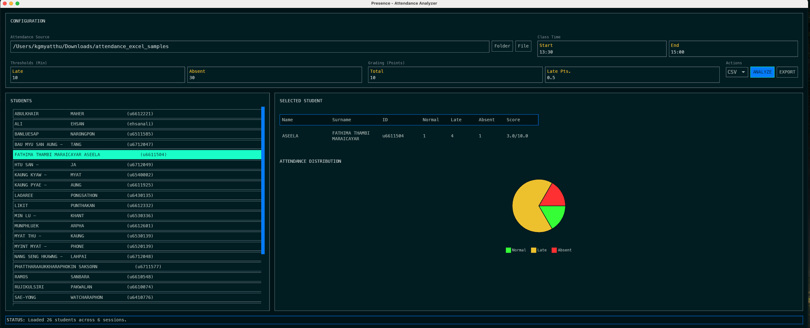

# Presence - Attendance Analyzer



## Introduction

**Presence** is a GUI-based attendance tracking and analysis tool designed for educators and administrators. It simplifies the process of monitoring student attendance by processing CSV and Excel files containing session logs.

With **Presence**, you can:
*   **Analyze Attendance**: Import session logs (CSV/Excel) to automatically calculate attendance status (Normal, Late, Absent) for each student.
*   **Customize Rules**: Configure class start/end times, late/absent thresholds (in minutes), and penalty points.
*   **Calculate Scores**: Automatically compute attendance scores based on your grading criteria.
*   **Visualize Data**: View individual student attendance distribution with interactive pie charts.
*   **Export Reports**: Generate detailed attendance reports in CSV, Text, or PDF formats.

## Prerequisites

To build and run **Presence** from source, you need the **Rust toolchain** installed on your system. This project requires **Rust 1.90.0** or newer.

*   **Install Rust**: Visit [rust-lang.org/tools/install](https://www.rust-lang.org/tools/install) and follow the instructions for your operating system.

## Build and Run Instructions

### Linux (Ubuntu/Debian)

On Linux, you need to install several system dependencies for the GUI framework (Iced) and audio/font libraries before building.

1.  **Install Dependencies**:
    ```bash
    sudo apt-get update
    sudo apt-get install -y pkg-config libasound2-dev libssl-dev cmake libfreetype6-dev libexpat1-dev libxcb-composite0-dev libfontconfig1-dev
    ```

2.  **Run the Application**:
    Navigate to the project directory and run:
    ```bash
    cargo run --release
    ```

### macOS

On macOS, the build process relies on the Xcode Command Line Tools, which are typically installed automatically or prompted for when using Git or Rust.

1.  **Ensure Command Line Tools are installed**:
    ```bash
    xcode-select --install
    ```
    *(If already installed, this command will notify you.)*

2.  **Run the Application**:
    Navigate to the project directory and run:
    ```bash
    cargo run --release
    ```

### Windows

1.  **Run the Application**:
    Open a terminal (PowerShell or Command Prompt), navigate to the project directory, and run:
    ```bash
    cargo run --release
    ```

## Usage Guide

1.  **Select Attendance Source**:
    *   Click **Folder** to select a directory containing multiple attendance files (CSV/Excel).
    *   Click **File** to select a single attendance file.
    *   The application will scan the selected source for valid participant data.

2.  **Configure Parameters**:
    *   **Class Time**: Set the `Start` and `End` times for your class (e.g., 13:30, 15:00).
    *   **Thresholds**:
        *   **Late**: Minutes after class start before a student is marked "Late".
        *   **Absent**: Minutes after class start before a student is marked "Absent".
    *   **Grading**:
        *   **Total**: The maximum total score possible.
        *   **Late Pts.**: The penalty points deducted (or awarded, depending on your configuration logic) for late attendance.

3.  **Analyze**:
    *   Click the **ANALYZE** button. The application will process the files and populate the student list.
    *   Select a student from the list to view their detailed attendance history and charts.

4.  **Export**:
    *   Choose a format (CSV, Text, PDF) from the dropdown menu.
    *   Click **EXPORT** to save the generated report to your computer.
